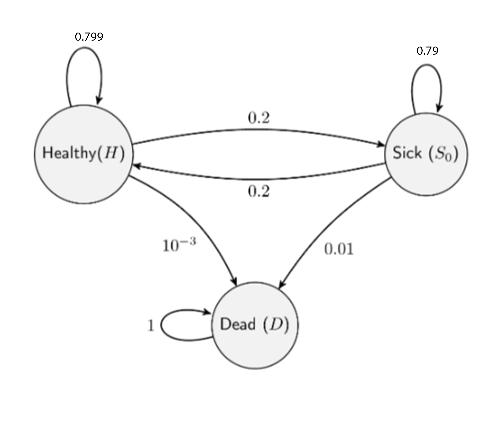
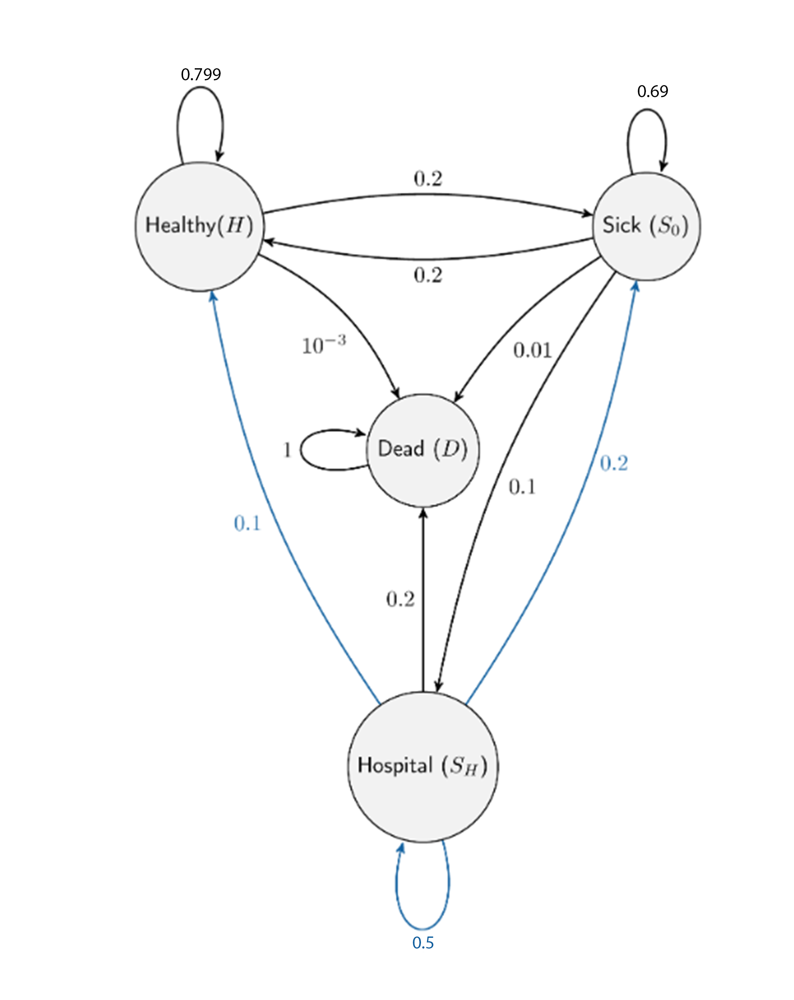

```{r setup, include=FALSE}
knitr::opts_chunk$set(echo = TRUE)
```

```{css, echo=FALSE}
.colors {
  background-color: lightyellow;
  border: 1px solid black;
}
```

# **1: Simulate sickness and hospitalization with Markov Chains ** 



**Q1:** Examine the following piece of code which simulates from a simplified version of the Markov Chain. This simplified version only has three states. Workout the values for a and b in the code below.
```{r message=FALSE, warning=FALSE, class.source="colors"}
#Set random simulation seed to allow consistent and comparable outputs
set.seed(42)
#a and b represent the probability of the patient remaining in the current 
#disease state (eg. H->H)  
a <- 1-(0.2+0.001)
b <- 1-(0.2+0.01)
#these represents the number of days this simulation is run for 1 patient 
n_days <- 400

#creates a matrix representing the markov chain above, each row represents one 
#node (eg. row one values = H).
transition_matrix <- matrix(c(a, 0.2, 0.001,
                          0.2, b, 0.01,
                          0, 0, 1), nrow=3, ncol=3, byrow=TRUE)
#define the starting state(node) of the patient.  
state <- 1
#create a vector of length n_days to store the patient state overtime 
patient_record <- rep(0, n_days)

#loop over number of n_days (400 loops in total)
for (day in 1:n_days) {
  #assign starting state probability values to pr variable 
  pr <- transition_matrix[state, ]
  
  #determine the following state c(1:3) by sampling one of the 3 matrix rows using the
  #probabilities from the current matrix row(node). 
  state <- sample(c(1:3), size = 1, prob = pr)
  #adds the state to the patient record at the position corresponding to the 
  #current day 
  patient_record[day] <- state
}

#plot on x time (number of days) and on y the state of patient as a line. 
#states represented are 1: healthy, 2: Sick, 3:Dead. 
plot(1:n_days, patient_record, "l")
```


**Q2**:Extend the code above to incorporate the 4th state creating a 4x4 transition matrix, based on the 4 state Markov Chain presented above. Plot the resulting patient record and comment on the plot. We define state 1 as H, state 2 as S0, 3 as state SH and state 4 as D. 




```{r message=FALSE, warning=FALSE, class.source="colors"}
#defines a function that given a transition matrix, number of days and starting state
hospitalization_patient <- function(transition_matrix,n_days,state, seed_n){
 #sets the seed for random function (eg. sampling)
 set.seed(seed_n)
 #create a vector of length n_days to store the patient state overtime
 patient_record <- rep(0, n_days)
 state <- 1
 #loop over number of n_days (400 loops in total)
 for (day in 1:n_days) {
  #assign starting state probability values to pr variable
  pr <- transition_matrix[state, ]
  #determine the following state c(1:3) by sampling one of the matrix rows. Matrix row number is   determined with nrow() using the
  #probabilities from the current matrix row(node). 
  state <- sample(c(1:nrow(transition_matrix)), size = 1, prob = pr)
  
  #adds the state to the patient record at the position corresponding to the 
  #current day
  patient_record[day] <- state
 }
 
 #returns patient record
 return(patient_record)
}

#obtain ? values in the 4 node markov chain
H_unk <- 1-(0.2+0.001)
S0_unk <- 1-(0.2+0.01+0.1)
SH_unk <- 1-(0.2+0.2+0.1)

#transition matrix variables representing probabilities in the markov chain.
H <- c(H_unk, 0.2,0,0.001)
S0 <- c(0.2,S0_unk,0.1,0.01)
SH <- c(0.1,0.2,SH_unk,0.2)
D <- c(0,0,0,1)

#defines the new transition matrix, days simulated and initial state
trans_matrix4N <- matrix(c(H,S0,SH,D), nrow=4, ncol=4, byrow=TRUE)
d_simulated <- 400
init_state <- 1

#Simulates markov chain outcome using different seeds. 
for (seed in 42:45){
 #calls the function assigning and assigns outcome to variable pt_rec. 
 pt_rec <- hospitalization_patient(trans_matrix4N, d_simulated,init_state,seed)
#plot on x time (number of days) and on y the state of patient as a line. 
#states represented are 1: healthy, 2: Sick, 3:SHospitalized, 4:Dead. 
#Here axis are further labelled for better clarity.   
 plot(1:d_simulated, pt_rec,ylab = "Patient state",
      xlab = "Days elapsed",
      col="darkorange",
      lwd=2.0,
      main = paste("Simulation with seed ",as.character(seed)),"l")
}


```

**Plots Comment:**
The above plots represent simulations involving the fluctuation of the health state 
of a patient overtime using modeled using a 4 node markov chain (MC). The assignment focused on plot generated using seed 42 (the first plot). In this plot, it can be seen that the patient reached the death state within the first 5 days. Hence,the 4 nodes MC, compared with the previous 3 node MC, suggests that worsening of patients conditions resulting in hospitalization increases the probability of death of patient. It must be stated that hospital is NOT the cause of the patient's death.


The plots using different seeds than 42 serve as an indicator of how seed affects the random sampling of sample() function. This is observed in the patient taking longer to reach the death state in the markov chain due to different random sampling. Interestingly, in all plots examined, the patient took >50 days to reach the death state. This further reinforces the previous point suggesting that worsening of patients conditions results in hospitalization, resulting in increased death probability. This thought experiment is limited by the quantity of seeds used, and should only be taken as a reference to be kept in mind on the impact of seeding in simulations.    

Interestingly, the graph starts from state 2 (Sick), suggesting that the patient become immediately sick on day 1. This could then further explain how quickly they fall dead.


**Q3: Use your code from Q2 to simulate 1000 patient records. Plot the distribution of the number of days spent in each state. Comment on the results.**
```{r message=FALSE, warning=FALSE, class.source="colors"}
hospitalization_patient <- function(transition_matrix,n_days,state){
 #sets the seed for random function (eg. sampling)
 #create a vector of length n_days to store the patient state overtime
 patient_record <- rep(0, n_days)
 #state <- 1
 #loop over number of n_days (400 loops in total)
 for (day in 1:n_days) {
  #assign starting state probability values to pr variable
  pr <- transition_matrix[state,]
  
  #determine the following state c(1:3) by sampling one of the matrix rows. Matrix row number is   determined with nrow() using the
  #probabilities from the current matrix row(node). 
  state <- sample(c(1:nrow(transition_matrix)), size = 1, prob = pr)
  
  #adds the state to the patient record at the position corresponding to the 
  #current day
  patient_record[day] <- state
 }
 
 #returns patient record
 return(patient_record)
}

set.seed(42)
#obtain ? values in the 4 nodes of markov chain
H_unk <- 1-(0.2+0.001)
S0_unk <- 1-(0.2+0.01+0.1)
SH_unk <- 1-(0.2+0.2+0.1)

#transition matrix variables representing probabilities in the markov chain.
H <- c(H_unk, 0.2,0,0.001)
S0 <- c(0.2,S0_unk,0.1,0.01)
SH <- c(0.1,0.2,SH_unk,0.2)
D <- c(0,0,0,1)

#defines the new transition matrix, days simulated and initial state
trans_matrix4N <- matrix(c(H,S0,SH,D), nrow=4, ncol=4, byrow=TRUE)
d_simulated <- 400
#init_state <- 1

#Initializes a empty vector containing all patients records for all days
total_pat <- 1000
total_out <- c()

total_df <- data.frame(matrix(ncol = 400, nrow = 0))
total_vect <- 

library(DataCombine)
#loops over each patient, creating a 400 days long record. 
for (patient in 1:total_pat){
 
 init_state <- 1
 #assigns initial state of the patient to the vector
 #calls the function assigning and assigns outcome to variable pt_rec. 
 pt_rec <- hospitalization_patient(trans_matrix4N, d_simulated,init_state)
 #appends each patient simulation to the total output vector
 total_out <- append(pt_rec,total_out)
 total_df <- InsertRow(total_df, pt_rec)
 init_state <- 1

}
plot_df = data.frame(States = total_out)

##Only need ot plot the dataframe## (melt and plot)

#dataframe to plot the states using ggplot
#ggplotting dataframe states against days using a histogram.
library(ggplot2)
ggplot(plot_df , aes(x= States)) +
 geom_histogram(binwidth = 0.6, fill = "darkorange", color = "black", alpha = 0.8) + 
 labs(x = "States", y = "Days spent", title = "Days spent in each state")+
 theme(plot.title = element_text(hjust = 0.5,size=15))


```

**Plot comments and interpretation**

The task involved simulating the life cycle of multiple patients which become affected by an X condition. This is achieved by providing 4 states: healthy(h), sick (S0), hospitalized (SH), and dead(D) for 1000 patients over a period of 400 days. The probabilities of a patient transitioning between the states was expressed in the following transitional matrix: 
	H 		S0 	SH 	D
H	0.799, 0.2,	0,	0.001
S0 0.2,	0.69,  0.1, 0.01
SH 0.1,	0.2,   0.5,	0.2
D 	0,	0,	   0,	1

As it can be seen, upon death of the patient, sensibly  the patient does not change to a different state, and death is accounted each day until the end of the simulation for that patient. This explains the heavy skewing on state 4. 

This model could be used to simulate represent life expectancy of a disease. This could be, for instance, cancer or an infectious disease. In the latter case, transition from healthy to sick could be referred to either represent actual infection (account for asymptomatic incubation period) or from symptom onset (does not account for incubation). To carry out this, different transitional matrices will need to be produced with different probabilities depending on the disease, healthcare capability of treating it and other factors.


# **2: Data analysis of tumor genetic expression**

### **2.1: Expression Comment**
(Q4) Study the following code example and add comments to describe what it does. Part 1 and Part 2 have been splitted into two snippets for ease of usage. 
```{r message=FALSE, warning=FALSE, class.source="colors"}
# ------------- Part 1 -------------
#Import library tidyverse for data manipulation and plotting
suppressWarnings(library(tidyverse))

#load the provided dataset
load("assess_data_resit-23.Rdata")

#generates a transposition of the logged transformed matrix Y (containing tissue type, patient_id,sample_id). Logged transformation is done to stabilize the variance. 
pca_x  <- t(log(Y + 1))
#carries out principal component analysis using transposed matrix. variables are scaled to a unit variance and variables are zero centered.
pca_res1 <- prcomp(pca_x, scale = TRUE, center = TRUE)
#generates a data frame containing the outcomes of the PCA analysis paired with the tissue classification (normal/tumour) paired with the respective patient.   
pca_df1 <- data.frame(
  pca_res1$x,
  tissue = patient_data$tissue,
  patient = patient_data$patient)

#plots PCA plot with problematic samples. It includes sample labels
ggplot(pca_df1, aes(x = PC1, y = PC2, color = tissue, label =patient)) +
  geom_point(size = 3) +
  geom_text(hjust = 0, vjust = 0)+
  theme_bw() +
  labs(x = "PC1", y = "PC2", title = "PCA with problematic samples") +
  theme(legend.position = "right",plot.title = element_text(hjust = 0.5) )
#removes the problematic sample pair from the PCA dataframe. 
pca_df1 <- pca_df1[c(-16,-1,-14,-29),]

#Removes problematic samples (columns) from raw dataframe and patients df
Y_clean <- Y[,c(-16,-1,-14,-29)]
patient_data <- patient_data[c(-16,-1,-14,-29),]

#Plots the data points (PC1 and PC2) in the pca_df1 as a scatterplot with point of size 3. Colours the points based on the tissue category, sets the theme to black and white, changes labels of x and y axis to PC1 and PC2 respectively. Finally, legend is positioned at the bottom.   
ggplot(pca_df1, aes(x = PC1, y = PC2, color = tissue)) +
  geom_point(size = 3) +
  theme_bw() +
  labs(x = "PC1", y = "PC2",  title = "PCA without problematic samples") +
  theme(legend.position = "right", plot.title = element_text(hjust = 0.5,size=15))
```
**PCA figures description**

PCA is a technique used for dimensionality reduction. In this case it used to observe clustering of gene expression from two groups of tissues (Normal and Tumour). The first PCA plot shows names samples to identify outliers. The second figure shows removal of problematic points couples representing patient 1 (samples 1 16) and patient 14 (samples 14 and 29) as they were considered outliers when compared to their relative clusters. 

4 samples in total were removed as each pair represented 1 patient, and keeping 1 sample without its healthy/tumour counterpart does not make sense as it does not allow differential expression comparison.The samples being outliers could be due to a multiple factors including:  error during recording and/or processing of the sample, poor RNA quality, and contamination. 


### **2.2: Differential Expression Analysis** 

Part 2 involves the modelling of gene expression for tumour and healthy cells. Although the source code provided is for gene 20, subsequent implementations allow to calculate whether a gene is relevant in cancer gene expression or not. 
```{r message=FALSE, warning=FALSE, class.source="colors"}
# ------------- Part 2 -------------
#imports library to use glm function. 
library(MASS)

#Determines which gene is looked at in the analyses
idx <- 20
# Determines how many patients(samples) are included in the analysis. This is not all patients available.  
c_cl <- 1:20
#Includes cell classiffication (Tumour/Normal) of a patient
x <- patient_data$tissue[c_cl]
# Determines how many patients are included in the analysis
z <- patient_data$patient[c_cl]

#tmp represents a summary table for all patients for 1 gene (row). It includes sample type(Tumour/Normal). Libsize represents the total amount of expression transcripts recorded for a gene in a range of specified patients (ie. column). 
tmp <- data.frame(y = Y_clean[idx, c_cl], x = x, z = z, lib_size = colSums(Y_clean[, c_cl]))

#performs the regression-based differential expression analysis for only one gene (row 20)
out <- suppressWarnings(glm(y ~ x + z + lib_size, data = tmp, family = "poisson"))

#outputs the p_value to obtained from regression analysis
p_val <- summary(out)$coefficients[2, 4]

```


**(Q6)** This code loops over all the genes (rows) accounting for all samples left 
after PCA analysis. The p-values outputted are then stored in a vector, which is adjusted with the bonferroni method to account for multiple testing. These values are then -logged 10 to better determine which genes are differentially expressed and which genes are not.

```{r message=FALSE, warning=FALSE, class.source="colors"}
#imports library to use glm function. 
library(MASS)
library(ggplot2)
#Determines how many p-values based on number of genes
p_values <- numeric(nrow(Y_clean))

for (gene in 1:nrow(Y_clean)){
  # Determines how many patients(samples) are included in the analysis. 
 #This are all patients available after removal of the paired outlier following PCA analysis.  
 c_cl <- 1:26
 #Includes cell classiffication (Tumour/Normal) of a patient
 x <- patient_data$tissue[c_cl]
 # Determines how many patients are included in the analysis
 z <- patient_data$patient[c_cl]
 
 #tmp represents a summary table for all patients for 1 gene (row). It includes sample type(Tumour/Normal). Libsize represents the total amount of genes recorded in for the specified patient (ie. column) 
 tmp <- data.frame(y = Y_clean[gene, c_cl], x = x, z = z, lib_size = colSums(Y_clean[, c_cl]))
 
 #performs the regression-based differential expression analysis for only one gene (row 20)
 out <- glm(y ~ x + z + lib_size, data = tmp, family = "poisson")
 
 #outputs the p_value to obtained from regression analysis
 p_values[gene] <- summary(out)$coefficients[2, 4]
  
}

#Adjusts p-values for multiple testing using bonferroni method
adj_p_vals1 <- p.adjust(p_values, method = "bonferroni")
#Createsdf fro ggplot
p_val_df1 <- data.frame(adj_p_val = adj_p_vals1, idx = 1:length(adj_p_vals1))


#Plots the logged p-values using ggplot
ggplot(p_val_df1, aes(x = idx, y = -log(adj_p_vals1))) +
  geom_point(shape = 1,stroke=1.5, size = 1.5, col = "#4c9abe") +
  labs(y = "-log10(adjusted p-value)", x = "Genes in dataframe", 
       title ="Differential Expression Analysis" )+ 
 theme(plot.title = element_text(hjust = 0.5,size=15))
```

**Figure description:**

The above dot plot describes genes correlation in the differential analysis with poisson distribution. 
The ones with the greatest values -log(p-values) are strongly correlated with the differential expression analysis, suggesting that they are differentially expressed between tumours and healthy tissues. The genes with -log(p-values) found at the bottom (close to 0) suggest that these genes are not involved in differential analysis, suggesting these genes are not differential expressed between tumours and healthy samples, hence they are likely not involved in the tumours lifecycle.

The gene with idx 20 has a p-value < 0.05, suggesting it is differentially expressed between the tumour and healthy tissue. 

**(Q7) Here further differential analysis was carried out using.**

In this snipped, differential expression is carried out on the given data sets. 
Furthermore models missing different covariates are compared and contrasted to 
determine which covariate is the one affecting the model fit the most.    
```{r, results='hide', message=FALSE, warning=FALSE, class.source="colors"} 

#Defines a function taking sample range,patient data, the expression data frame, and which removed 
reg_expression <- function(c_cl_2, patient_data_df,expression_df, rm_var){
 #allows us to include tissue type in analyses (Tumor/Normal)
 x_2 <- patient_data_df$tissue[c_cl_2]
 # Determines how many patients are included in the analysis and their label 
 z_2 <- patient_data_df$patient[c_cl_2]
 # Initialize an array to store p-values
 p_vals <- rep(0,nrow(expression_df ))
 
 #this if-loop executes if the tissue category (x) wants to be omitted from the analysis 
 if (rm_var == "tissue"){
  for (i in 1:nrow(expression_df )) {
   #tumour category(x) is removed from summary dataframe
   tmp_2 <- data.frame(y = expression_df[i, c_cl_2], z = z_2, lib_size = colSums(expression_df[, c_cl_2]))
   #tumour category(x) is removed from glm analysis
   out_2 <- glm(y ~ z+ lib_size, data = tmp_2, family = "poisson")
   p_vals[i] <- summary(out_2)$coefficients[2, 4]
  }
 }
 
 #Executes regression analysis without accounting for lib_size 
 if (rm_var == "lib_size"){
  for (i in 1:nrow(expression_df )) {
   tmp_2 <- data.frame(y = expression_df[i, c_cl_2], x = x_2, z = z_2)
   #here, lib_size is removed from  glm analysis
   out_2 <- glm(y ~ x + z, data = tmp_2, family = "poisson")
   p_vals[i] <- summary(out_2)$coefficients[2, 4]
  }
 }

 #Executes regression analysis accounting for all original variables. 
 if (rm_var == "none"){
  for (i in 1:nrow(expression_df)) {
   tmp_2 <- data.frame(y = expression_df[i, c_cl_2], x = x_2, z = z_2, lib_size = colSums(expression_df[, c_cl_2]))
   out_2 <- glm(y ~ x + z + lib_size, data = tmp_2, family = "poisson")
   p_vals[i] <- summary(out_2)$coefficients[2, 4]
  }
 }
 # Adjust p-values for multiple testing using Bonferroni correction (corrects p-value as in multiple tested genes, some could be recorded "expressed" by chance)
 adj_p_vals <- p.adjust(p_vals, method = "bonferroni")
 
 # Create a data frame with -logged adjusted p-values and gene index
 p_val_df <- data.frame(adj_p_val = adj_p_vals, idx = 1:length(adj_p_vals))
 
 
 # Load the ggplot2 library 
 library(ggplot2)
 title <- paste("Differential Expression with", rm_var,"removed")
 # Create a plot of exp(adjusted p-values) compared against 
 # Create a plot of -log10(adjusted p-values) compared against gene index
 p_plot <- ggplot(p_val_df, aes(x = idx, y = -log(adj_p_vals))) +
  geom_point(shape = 1,stroke=1.5, size = 1.5, col = "#4c9abe") +
  labs(y = "-log10(adjusted p-value)", x = "Gene in dataframe", title =title)+
  theme(plot.title = element_text(hjust = 0.5,size=15))
 
 print(p_plot)
 
 #Plots a heatmap to better observe differential expression. Red represents genes which are more significantly differentially expressed. 
 h_plot <- ggplot(data = p_val_df, aes(x = idx,y=1,fill = -log(adj_p_vals))) +
  geom_tile() +
  scale_fill_gradient(low = "#0288d1", high = "#FF0000") +  # Adjust color scale
  labs(title = paste("Heatmap of differential expression with", rm_var,"removed"), 
       x = "Gene", y = NULL) +
  theme(plot.title = element_text(hjust = 0.5,size=15))
 
 print(h_plot)
 
 return (p_val_df)
 
}
#SupressWarning is used to remove warning regarding p-value not being integer. This does interfere with the analysis.
#uses above function to determine the regression accounting for all the variables
adj_p_df <- suppressWarnings(reg_expression(1:26, patient_data, Y_clean, "none"))
#uses above function to determine the regression without the patient tumour/normal category (see above for commented inner function)
tissue.rm_df <- suppressWarnings(reg_expression(1:26, patient_data, Y_clean, "tissue"))
#uses above function to determine the regression without the lib size (see above for commented inner function)
suppressWarnings(reg_expression(1:26, patient_data, Y_clean, "lib_size"))

#Dataframes containing genes found differentially expressed without covariates removed 
diff_expression_df <- adj_p_df[adj_p_df$adj_p_val < 0.05,]
diff_expression_sens_df <- adj_p_df[adj_p_df$adj_p_val < 0.01,]

#Dataframes containing genes significant for differential expression with tumour covariate removed
diff_tumour_df <- tissue.rm_df[tissue.rm_df$adj_p_val < 0.05,]
diff_tumour_sens_df <- tissue.rm_df[tissue.rm_df$adj_p_val < 0.01,]


```


```{r message=FALSE, warning=FALSE, class.source="colors"}

#Outputs identified genes with and without tumour covariate
cat("Number of differentially expressed genes identified with all covariates (p-values < 0.05):", toString(length(diff_expression_sens_df$idx)), "\n")
cat("Number of differentially expressed genes identified without tumour covariate (p-values < 0.05):",toString(length(diff_tumour_sens_df$idx)), "\n")

#Defines a function to compare models
model_comparison <- function(c_cl_2, patient_data_df,expression_df){
 #allows us to include tissue type in analyses (Tumor/Normal)
 x_2 <- patient_data_df$tissue[c_cl_2]
 # Determines how many patients are included in the analysis 
 z_2 <- patient_data_df$patient[c_cl_2]
 #Defines a temporary dataframe of using gene 20 expression to allow comparison with the different models.
 tmp_2_df <- data.frame(y = expression_df[20, c_cl_2], x = x_2, z = z_2, lib_size = colSums(expression_df[, c_cl_2]))
 
 #Define different models with covariates missing. The name of the variable is the covariate that has been removed.
 no_changes <- glm(y ~ x_2 + z_2 + lib_size, data = tmp_2_df, family = "poisson")
 tissue.rm <- glm(y ~ z_2 + lib_size, data = tmp_2_df, family = "poisson")
 patient_lb.rm <- glm(y ~ x_2 + lib_size, data = tmp_2_df, family = "poisson")
 lib_size.rm <- glm(y ~ x_2 + z_2, data = tmp_2_df, family = "poisson")
 
 
 
 #Compares normal model with model without tissue covariate. This is carried out using the 
 # anova to compare Godness of fitness. 
 print("No changes vs tissue covariate removed")
 print(anova(no_changes, tissue.rm, test = "LRT"))

 #Compares normal model with model without patient label covariate.This is carried out using the 
 # anova compare Godness of fitness. 
 print("No changes vs patient label removed")
 print(anova(no_changes, patient_lb.rm, test = "LRT"))

 #Compares normal model with model without lib_size covariate.This is carried out using the 
 # anova to compare Godness of fitness. 
 print("No changes vs lib_size removed")
 print(anova(no_changes, lib_size.rm, test = "LRT"))
 
}

#Compare models to determine whether tumour category makes a difference in the model.
#See model_comparison function for comments.
model_comparison(1:26, patient_data, Y_clean)
```

**Limitation**: these p-values are adjusted with Bonferroni method, which is a conservative algorithm to account for multiple testing. 
This should be kept in mind as this could result in increased Type II error due to algorithm's stringency.

**Filtered dataframes**
diff_expression_sens_df and diff_expression_df contain dataframes were the genes have been filtered based on p-values to determine which genes are effectively differentially expressed. 2 different p-values have been applied to display difference between stringency and specificity in filtering. p-values < 0.05 is  less stringent, allowing to obtain more true positives at the cost of lower specificity (ie. true negative rate). A p-value < 0.01 will increase specificity, but will result in higher stringency as well (ie. some true positives could be left out). Given that most p-values are much smaller than 0.01 and have been adjusted with bonferroni which is already conservative, using a threshold of 0.05 on adjusted p-values will grant an outcome with significant accuracy and specificity.

Given the threshold of p-value < 0.05, data-frames containing the outcome from the differential analysis with and without the tumour covariate were created. Including all covariates 4497  genes were identified, whilst removing tumor covariate  identified only 4410 genes. This suggest that including the tumour covariate allows to identify an extra 87 genes as differentially expressed.     


**Graph overview**

Models with different covariates removed have been plotted using a dot-plot and heatmap to highlight differential expression.
In the first two plots (heatmap and dot plot) it can be seen that a few genes have higher significance in the differential expression analysis and more strogly. In the heatmap this is represented by the color red and in the dot plot by higher value p-values. The grey and blue areas in the heatmap show genes that are not differentially expressed between the two sample types. The most likely to be differentially expressed are the genes are the ones with the highest p-values as -log  transformation results in lower p-values to become higher numerical values. This is done to allow easier interpretation and clearer plotting. 

**Compare plots and models tests**
H0: there is no difference in predictive strength of the model between adding or removing a specific covariate. 
H1: removing a covariate results in worse or better model predictive ability.

When "tissue" co-variate, which is a categorical variable whether the tissue sample is tumour or normal, is removed the model loses information. This can seen as an increased amount of genes cluster towards the bottom of the dot-plot and turn blue on the heatmap. This means that more genes become less relevant in the analysis. 

Although this could be useful as it makes the model easier to interpret, as there is reduction of "mediumly significant" genes (middle dots in dotplot and grey areas in heat map, the loss of information prevents a more accurate analysis of differentially expressed genes. 

To determine which co-variate has the biggest impact, anova was carried out testing between the model with all covariates and one covariate removed. It was found that all 3 co-variates highly impact the model when removed, as in all three cases the p-value is really low (p-value< 2.2e-16). The magnitude of the impact of a co-variate removal can be determined by looking at the change in deviance of the model (ie. the measure of godness of a statistical fit in a model). A decrease in this value will result in a poorer fitting model as it reflects the residuals deviance from the fitted line. In regression, the model is considered better when the deviance is decreased, as this means that the line is better fitting the data points.  

The biggest change in deviance is observed by removing the co-variate "patient label", as removing the covariate has a magnitude change of 175217. The tissue categorization has the second biggest impact with a deviance difference of 16079. Lastly, the lib_size covariate has the least impact on the model when compared to the other co-variates with a deviance difference of 6462.

In conclusion, removing any of the previously discussed co-variates results in worse fitting of the model, with patient label having the worst impact when removed. 
